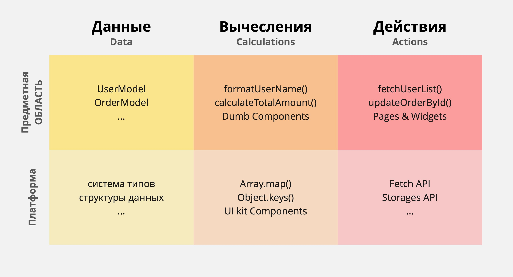

# Как структурировать код, а не просто раскладывать файлы по папкам

Существует распространенное заблуждение, что правильно выбранная структура папок и файлов поможет сделать хорошую архитектуру. В действительности же, файловая структура это лишь следствие архитектуры самого кода.

Чёткое понимание, из каких компонентов состоит ваш код, и как эти компоненты могут взаимодействовать друг с другом, подскажет вам как именно организовать файловую структуру ваших проектов.

Итак, код любого приложения можно разделить на три главных компонента:

### Данные

В оригинале, это «факты, относящиеся к событиям», которые я дополняю структурами данных и системой типов. По сути, это любые данные, которыми оперирует код, а также типы описывающие их.

### Вычисления

Компоненты, «преобразующие ввод в вывод», также называемые чистыми функциями. Сюда же относятся и презентационные (глупые) UI компоненты.

### Действия

Компоненты, которые «влияют на окружающий мир или находятся под его воздействием», также называемые грязными функциями, или функциями с побочными эффектами. К действиям, в том числе, относятся управляющие (умные) UI компоненты.

Дополнительно, каждый компонент можно разделить на две категории:

### Платформа

Включает код для работы с базовыми типами данных (объекты, массивы и т.д.) и API платформы. Сюда же попадают и npm пакеты не привязанные к конкретной предметной области, например react.

### Предметная область

Включает код отвечающий за описание структуры предметной области, и содержащий ту самую «бизнес логику».

## Резюме

Именно действия являются главной причиной выполнения программ, и они же являются источником большинства ошибок. Также важно понимать, что **любой код, использующий действия, сам становится действием**!

**Действия — зона повышенных рисков!**

Для снижения рисков и потенциальных проблем, при проектировании и разработке, необходимо:

- Строго разграничивать код, отвечающий за данные, вычисления и действия;
- Снижать количество кода отвечающего за действия, в пользу вычислений;
- Объединять (логически) связанные действия в одном месте (вспоминаем принцип SRP).
