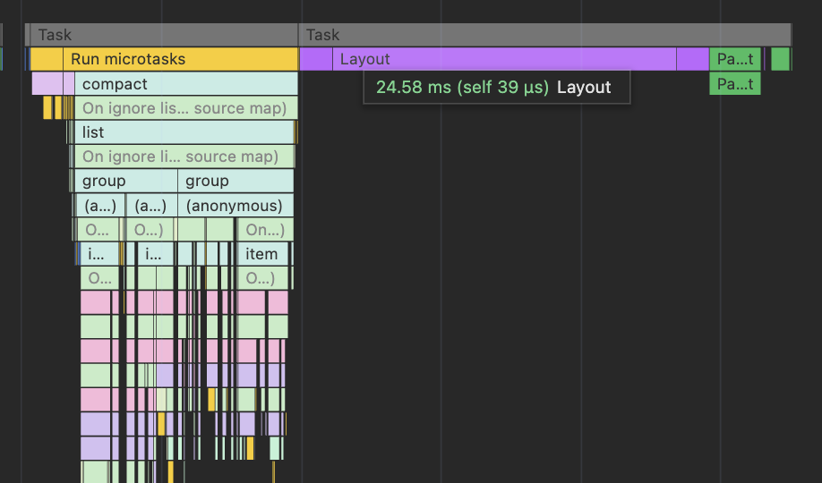
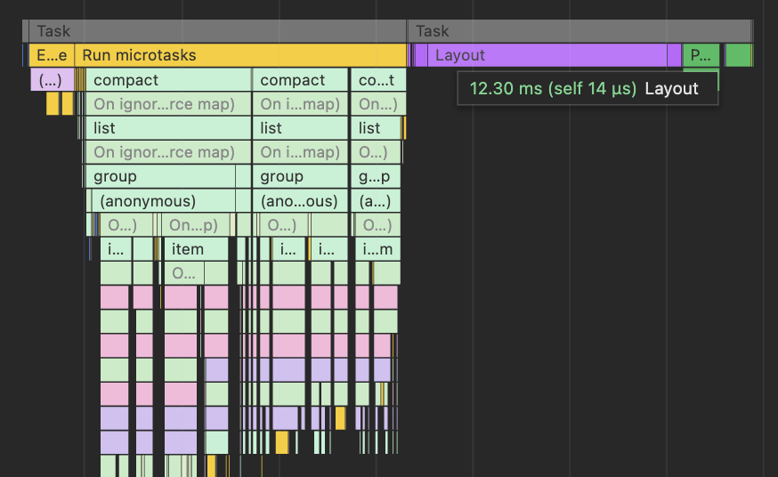

# CSS content-visibility

Оптимизировать скорость отображения большого количества элементов можно не только через Javascript. Хороший пример — CSS свойство `content-visibility`, которое напрямую влияет на такие этапы как recalculate styles, layout и paint. Для примера, рассмотрим простой SolidJS код отображения списка из 1898 emoji разделённых на 9 групп:

https://github.com/SanichKotikov/solid-emoji-demo (компонент EmojiList)

Если запустить приведённый выше пример, и посмотреть во вкладку Performance инструментов разработки браузера, вы увидите что бОльшая часть времени уходит не на выполнение Javascript, а на тот самый layout. Происходит это потому, что браузеру нужно “посчитать” весь список полностью, несмотря на то что пользователь видит только малую его часть. Вот тут нам и пригодится `content-visibility`, с помощью которого мы можем “попросить” браузер не считать то, что пользователь ещё не видит (в нашем случае группы).

Обратите внимание, что “спрятанный” таким образом контент остаётся достижимым для таких операций как поиск на странице, в отличие от виртуализации на Javascript.

_Важное примечание: Цифры приведённые ниже — MacBook M1. Для сравнения, iPhone 12 pro в режиме сбережения энергии будет в 4 раза медленнее! Кстати, именно такое замедление CPU является рекомендованным в Chrome._



```
Recalculate:  ~6 ms
Layout:       ~24 ms
Paint:        ~4 ms
Общее время:  ~56 ms
```

Добавим оптимизацию и посмотрим что изменится.

```javascript
{
  'content-visibility': 'auto',
  'contain-intrinsic-size': `auto ${size}px`,
}
```



```
Recalculate:  ~2 ms
Layout:       ~12 ms
Paint:        ~2 ms
Общее время:  ~37 ms
```

Кстати, без свойства `contain-intrinsic-size`, которое “бронирует” место под содержимое групп, “магии” не получится.

По итогу, можно сказать что _двумя строчками CSS_ мы сократили время отображения списка на ~34%. Да, можно сократить ещё, но об этом в другой раз.

_П.С. Вычислять высоту через JS не обязательно, можно заранее посчитать и указать среднее значение в CSS. Однако в таком случае бегунок прокрутки может иногда прыгать._
