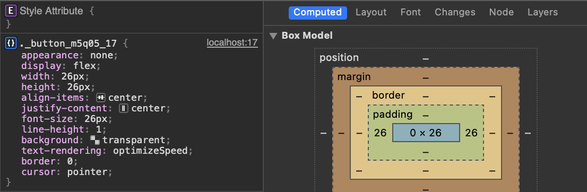

# Внутренние отступы кнопок в мобильном Safari



Столкнулся с занятной особенностью мобильного Safari. Если явно не указать внутренние боковые отступы (paddings) у элемента `button`, браузер проставит их автоматически отталкиваясь от размера шрифта.

Кстати, если вы хотите полностью сбросить стили кнопок по умолчанию:

```css
button {
  padding: 0;
  margin: 0;
  font-size: inherit;
  border: none;
  background: none;
  appearance: none;
}
```
