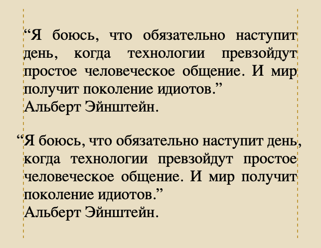

# CSS свойство, которое работает только в Safari

Оказывается, и такое бывает. 😅 Safari — единственный (на момент написания этого поста) браузер, который поддерживает hanging-punctuation, аж с 2016 года.

```css
hanging-punctuation: first allow-end last;
```



Это свойство отвечает за “висячую пунктуацию”, которая широко известна в кругах профессиональных верстальщиков (тех, что верстают печатную продукцию типа журналов и т.п., а не эти ваши css + html 😎).

_Висячая пунктуация — это способ набора и вёрстки текста, при котором знаки препинания, скобки, кавычки, дефисы и маркеры списков, находящиеся в начале или в конце строки, смещаются за границы основного блока текста, то есть "вывешиваются" на поля._

В общем, если типографика для вас не пустой звук, не забывайте что есть такое свойство.
