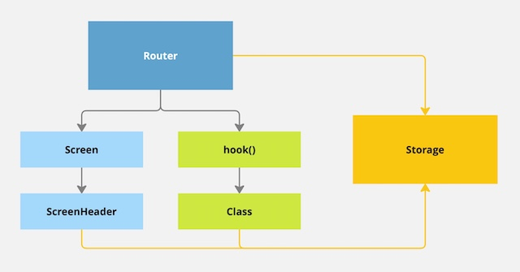
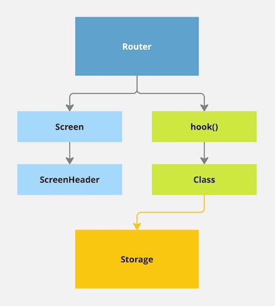
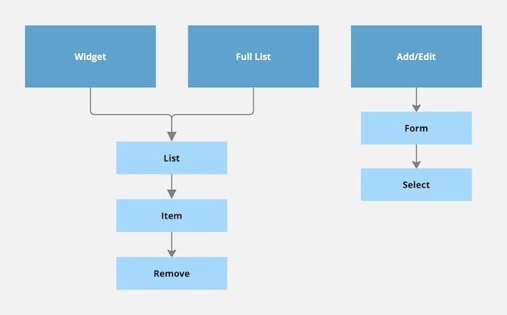
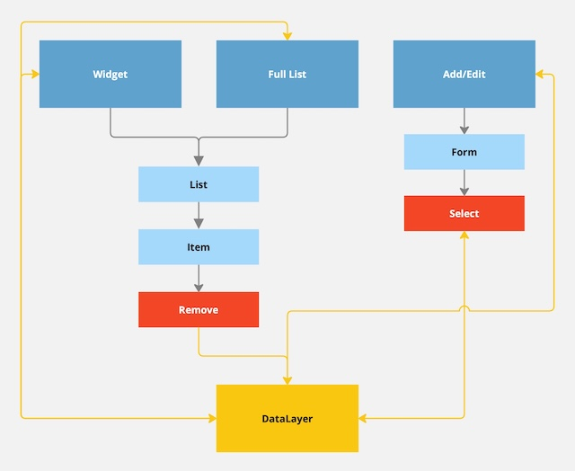
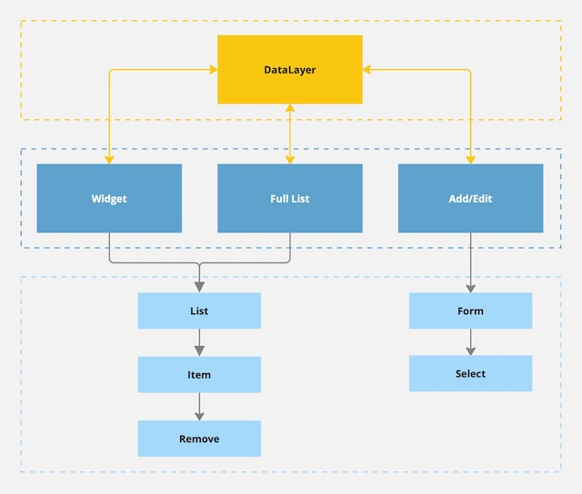

# Архитектура: размазывание ответственности

Рассмотрим одну из основных проблем при разработке (архитектуре) веб-приложений, которую я называю “размазывание ответственности”. В данном случае, речь пойдёт только про один аспект — прямая связь UI компонентов со слоем данных (через импорты) и, как организовать эту связь так, что бы и сам код и работа с ним была чуть более предсказуема и понятна.

## Пример №1

Посмотрим на первую схему:

Есть некоторое приложение (Router), на котором есть страница (Screen) и хук с классом, и всё это завязано на работу с одним значением в локальном хранилище (Storage). Обратите внимание на жёлтые стрелки — это то, как именно компоненты связаны с хранилищем:

- Router содержит действие, которое удаляет значение;
- Router выполняет hook, который создаёт Class (читает и меняет значение);
- ScreenHeader читает значение.

В этих связях и заключается проблема, их много и они разбросаны по разным частям приложения как придётся. Всё это усугубляется ещё и тем, что кто-то обращается к хранилищу напрямую (через API браузера), а кто-то через специальный хук (его нет на схеме). В подобном коде вообще не очевидно что и где происходит, как говорится “без поллитра не разберёшься”.

А вот, как это должно быть:

Во-первых, все действия с ячейкой хранилища должны быть собраны в ОДНОМ единственном месте. В нашем случае это Class. Это кстати не означает что, например, ScreenHeader теперь должен быть (напрямую) связан с Class, что и отображено на схеме но может быть не очевидно.

Во-вторых, точка связи между UI и Storage должна быть также ОДНА (“где вошли, там и вышли”), через hook и Class. А до ScreenHeader значение можно пробросить, например, через параметры компонентов.

## Пример №2

- Widget — независимый блок (на большой странице) с ограниченным списком;
- Full List — всплывающая страница с полным списком;
- Add/Edit — всплывающая страница добавления или редактирования элемента списка.

Обратите внимание, что Widget и Full List используют одинаковую цепочку компонентов для отображения списка. При этом, каждый элемент можно удалить или отредактировать, а также добавить новый.

Набросим схему работы с данными:

Схема уже не кажется такой простой. 😅 А всё потому что мы имеем туже проблему, что и в первом примере — слишком много точек связи с данными (Data Layer). Widget и страницы — “управляющие компоненты”, им положено быть связанными со слоем данных. А вот компоненты Remove и Select — нарушители (поэтому и выделены цветом).

Решается также просто как и в первом примере, правильной настройкой связей:

Обратите внимание, что сама схема стала приятнее на вид, и наш слоёный “пирог” приобрёл логический вид — сверху данные, потом управляющие компоненты, а в самом низу “глупые” компоненты. Из чего кстати, легко выводится правило — “умные” компоненты, напрямую связанные с данными, не могут находиться в конце цепочки из “глупых”, т.е. внизу.

П.С. Всегда бывают исключения, но они должны быть сильно оправданы.
