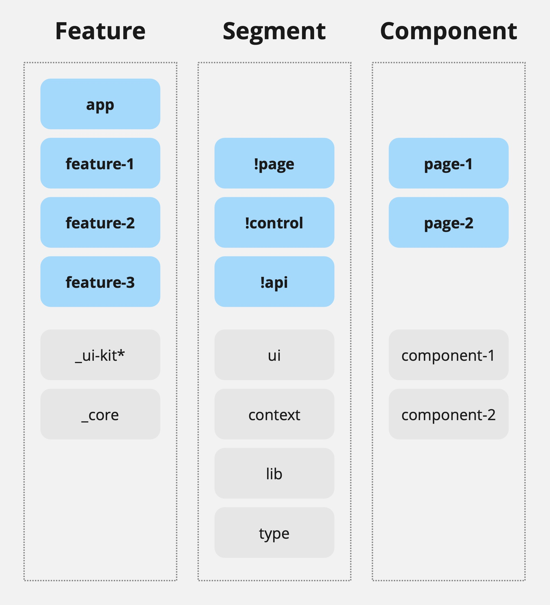

# Архитектура: раскладываем код по папкам

_Примечание №1: под словом “компонент”, без приставки UI, будет подразумеваться именно компонент системы, а не интерфейса._

_Примечание №2: какой бы вы подход не выбрали, этот, FSD, классический или ещё какой-то, это никак не скажется на качестве вашего кода и системы в целом. Правила это не главное, главное то как ими распорядиться._

Пришло время описать схему, по которой я “раскладываю код по папкам”, года так с 2019. Всё это время я пробовал менять в ней разные нюансы, сравнивал, делал выводы, но база оставалась всегда одна — фокус на предметной области. Максимально простое объяснение этой схемы можно выразить следующей строкой:

```
Feature/Segment/Component
```



Предположим, вы пишите приложение для сети общепита. В данном случае предметная область будет включать сотрудников, филиалы, меню и заказы. Добавим ко всему этому “базовую” функциональность и компоненты касающиеся самого приложения и получим верхний уровень структуры:

📁 _core  
📁 _ui-kit*  
📂 branch  
📂 employee  
📂 menu  
📂 order  
📁 app  

Папку `_core`, в теории, можно переносить из проекта в проект, т.к. она не должна содержать ничего что относится к нашей предметной области. А вот что она должна содержать, так это всевозможные утилиты для работы с примитивами языка, api платформы (`fetch`, `storages`), какие-то базовые хуки (если мы используем `React` или `SolidJS`), типы и т.п. Компоненты из папки `_core` можно использовать в любой части системы, при этом сама папка не может импортировать что-либо из соседних папок.

В папке `_ui-kit` лежат все базовые UI компоненты: кнопки, поля ввода, выпадающие списки и т.п. Компоненты этой папки можно использовать в любой части системы, кроме папки `_core`. В случае если вы используете сторонний ui-kit, то возможно, разумнее будет положить свои дополнительные UI компоненты в `_core/ui`.

В папке `app` хранится всё, что относится к специфике текущего приложения, но при этом не относится ни к _core, ни к предметной области. Это может быть общая разметка, интеграции со сторонними сервисами, логирование ошибок и т.п. Эта папка может использовать любые другие, но её использовать ни кто не может.

Все остальные папки верхнего уровня — “фичи” предметной области. Эти папки могут использовать компоненты из любой другой, кроме app. Кстати, в использовании компонентов из одной фичи в другой нет ни чего плохого, главное чтобы не было циклических зависимостей.

## Второй уровень — Segment

Этот уровень описывает сегменты из которых может состоять любая папка первого уровня. Перечислю основные:

📁 type — typescript типы;  
📁 lib — утилиты и хуки;  
📁 context — контексты и их типы;  
📁 ui — “глупые” UI компоненты;  
📂 api — общение с сервером;  
📂 control — “умные” UI компоненты и провайдеры;  
📂 page — страницы;  

Сразу отмечу что порядок, в котором выстроен этот список, имеет важное значение — сегмент может использовать всё что расположено выше него, и не может использовать всё что ниже. Например, `page` может импортировать модули из `api`, а вот `ui` не может.

Второй момент, на который стоит обратить внимание — `api`, `control` и `page` являются “умными” сегментами, т.к именно тут сосредоточены “действия”. Всё остальное должно относится к “вычислениям” или “данным”.

Иногда я думаю над тем, что бы добавить этим трём папкам какой-то префикс, например `!`, который бы отличал их от остальных. Но пока это открытый вопрос.

## Третий уровень — Component

Тут только одно, но очень важное, правило: компонент может быть как единственным файлом, так и папкой с экспортом через index-файл внутри. Другими словами, импорт любого компонента вашей системы должен быть из трёх составляющих:

```javascript
import { component } from 'feature/segment/component';
```

Ещё один важный момент: в папках первого и второго уровней не должно быть ни одного index-файла. Кого-то это может возмутить, мол как же так, но стоит вам попробовать и вы поймёте всю прелесть этого решения. 😎 По сути, в этой системе “публичным” интерфейсом обладают только её компоненты.

Также допустимые импорты:

```javascript
// Соседний компонент
import { component } from '../component';

// Соседний файл
import { component } from './component';
```

Примеры не допустимых импортов:

```
../../something,
../../../something и т.п.
../component/file-inside
domain/segment/component/file-inside
```

Из этих примеров должно быть понятно, что схема не подразумевает глубокой вложенности папок, всё должно быть максимально плоско.

Думается мне, этим постом можно закрыть серию про архитектуру, по крайней мере на какое-то время.

П.С. Пишите хорошие (маленькие) функции, и хорошая архитектура сама подтянется.
