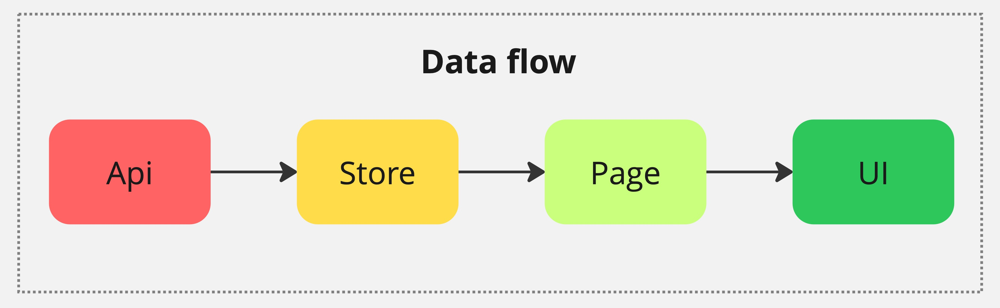

# Data Flow и модификация данных

_Data Flow (поток данных) — концепция, описывающая движение данных между различными компонентами системы._

**Желательно избегать модификации данных на всём пути этого потока**, однако бывают различные ситуации, в том числе и бизнес требования, когда модифицировать данные всё же приходится. Самый простой пример — сортировка. И вот тут возникает главный вопрос — а где именно эти данные модифицировать? Универсальный (простой) ответ — **максимально близко к тому месту, где это требуется**.

Например, если речь идёт о какой-то локальной сортировке в одном или нескольких UI компонентах, тогда желательно это делать именно там. Грубой ошибкой, в данном случае, будет сортировка в модуле API.

И наоборот, если модификация продиктована разницей именования полей между фронтом и беком, идеальным местом будет модуль API.
