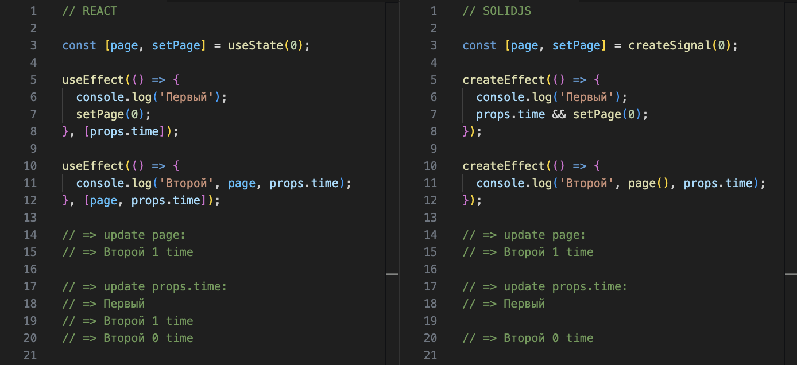

# React != SolidJS на примере эффектов

Несмотря на высокую “внешнюю” схожесть, под капотом эти библиотеки отличаются как чёрное от белого. В отличие от React с его предсказуемым жизненным циклом, компоненты Solid выполняются только один раз, а дальше в дело вступает реактивная система, которая выполняет только то, что действительно должно быть выполнено, и делает это оптимально.

П.С. Менять состояние из эффектов — довольно плохая идея и лучше такого кода избегать, в React так точно.
